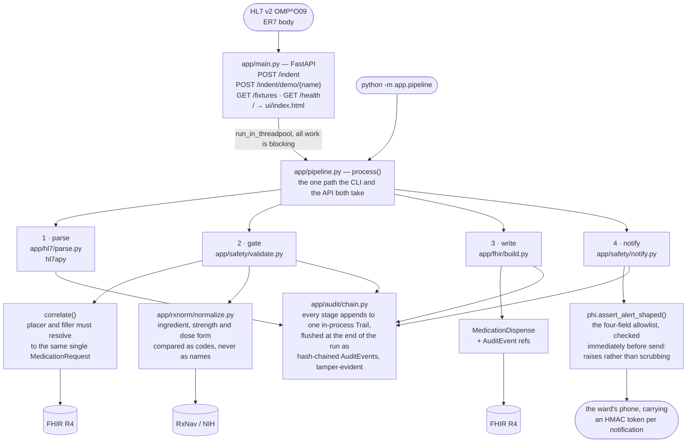

# Cold-chain dispensing gate — Case 1

A pharmacy cold-chain indent arrives as an HL7 v2 `OMP^O09` message. This service reads
the prescription behind it from FHIR, validates the ordered drug against RxNorm by *code*,
writes back a `MedicationDispense` saying what was packed, who is carrying it and when it
will arrive, sends the ward a notification with **no patient data in it**, and records
every outcome in a hash-chained `AuditEvent` trail.

Anything it cannot verify, it refuses. A hold is a successful run — the gate working.

---

## See it work

**<https://coldchain-gate.vercel.app>** — seven buttons, one per indent, nothing to install.

Press **Wrong strength**. The verdict line says in one sentence what happened; the middle
column, which lists the four fields permitted to reach the ward's phone, empties to "nothing
crossed"; the phone card goes grey; and the audit chain shows the two events a hold writes
instead of the four a dispense does. That refusal is the whole system, and it is invisible
from the outside — an indent that stops at the gate looks exactly like one that was never
sent. Press **Correct drug** to watch the same page dispense.

Every value on it comes from a real run behind a real HTTP request, not a screenshot or a
mock-up — and the run is **live**: the click resolves the drug against NIH RxNav over the
network and writes the `MedicationDispense` and its audit chain to the public HAPI sandbox.
The dataset is namespaced and the resources are written by `PUT` with client-assigned ids, so
your click cannot collide with anyone else's records and pressing the same button twice
replaces its own resources rather than adding duplicates. Quickstart below covers the offline
path, which is the one to use if you would rather write nothing to a shared server.

---

## Quickstart

```bash
python3 -m venv .venv && .venv/bin/pip install -e ".[dev]"   # 1. install
make run-offline                                             # 2. serve it — http://127.0.0.1:8000
```

Then, in another shell:

```bash
make smoke                    # POST one indent, print the scrubbed response
make test                     # 323 tests, fully offline
curl -s localhost:8000/fixtures      # the demo indents, by name
```

The HTTP and test dependencies are deliberately pinned and the full offline suite runs in
GitHub Actions on every push and pull request. The pins protect the ASGI test harness from a
future FastAPI/Starlette/httpx combination that has not been verified by this project;
upgrading a framework is a deliberate change accompanied by a green suite, not a resolver
surprise.

**Open `http://127.0.0.1:8000` in a browser.** That is the demo page: seven buttons, one per
fixture, and each one sends a real HL7 message through the pipeline and shows what came back —
the verdict, the four fields that crossed to the phone, and the audit chain the run wrote. Six
of the seven are indents a hospital could genuinely send and this system refuses, which is the
part worth watching. Start with the one that works.

The page also opens straight off the filesystem, with no server and no install: it carries a
recorded set of the same seven runs (`scripts/build_ui_demo.py`, checked against a fresh run by
`tests/test_ui.py`), and upgrades to live runs on its own when it finds a server. Nothing on it
is typed by hand — every value is either read from the API or from that recording.

### What is and is not live

`make run-offline` serves FHIR from memory, so a local demo writes nothing to a shared server
and cannot be broken by someone else's data. **The RxNorm lookup is not offline there.** It is
a separate NIH service and still goes out, because a code lookup is the point of the exercise —
and `make test` replays recorded RxNav payloads instead, which is why the suite needs no
network at all. If NLM is unreachable the indent ends as a clean `503`: the check did not run,
so nothing is dispensed.

The hosted demo is live on both sides. `api/index.py` runs the identical `create_app` with
nothing injected: the RxNorm lookup really goes to `rxnav.nlm.nih.gov`, and a dispense really
writes to `hapi.fhir.org/baseR4`. That is the honest version of "click it and see", and it
costs something worth naming. A click depends on two services nobody here controls, so if
either is down the indent ends as a clean `503` — the check did not run, so nothing was
dispensed. That is the system working, but it reads as a broken demo, and `GET /health` is
where you tell the two apart. It reports the upstream URLs it will actually call, so it is
worth a glance before blaming the page.

`GET /health` also explains the counters it reports. On Vercel they are per instance, so
`indents_processed` can read lower than the number of buttons you have pressed; no *result*
depends on that state, because every indent is answered inside a single request.

One deployment detail is worth knowing because it nearly went unnoticed. `vercel.json` sets
`framework: null`; without it Vercel finds `app/main.py`'s module-level `app` — the
*sandbox-configured* application, since that is the one `uvicorn app.main:app` needs — and
serves it in preference to `api/index.py`. The result is a deployment that answers correctly
while quietly writing to a public server other people also use. `api/index.py` explains how
that was caught.

For the real thing against the public HAPI sandbox, `make run` — seed once with `make seed`
first.

### The demo dataset is already published

`make seed` is idempotent (`PUT` with client-assigned ids), and the dataset is already on
the public sandbox under namespace `sajib-cc-58f1` — the default, so a fresh clone finds it
and `make seed` is a no-op. HAPI enforces uniqueness on `Patient.identifier` *globally*, so
`MRN12345` has exactly one owner; switching `DEMO_NAMESPACE` without also changing the
identifiers in `app/demo.py` and the HL7 fixtures will fail with `HAPI-2840`. `make seed`
prints those instructions if you hit it.

---

## Architecture



Every stage blocks — `httpx` and `hl7apy` are both synchronous — so the whole pipeline runs in
a threadpool rather than on the event loop. That is what `run_in_threadpool` above is for: one
slow FHIR write cannot stop the process answering `/health`.

---

## The brief, requirement by requirement

| # | Requirement | Where |
|---|---|---|
| 1 | Read the prescription via FHIR `MedicationRequest` | `app/fhir/client.py`, correlated by the populated **placer and filler order identifiers** (which must agree) and then matched to the patient |
| 2 | Validate the drug against NIH RxNav/RxNorm | `app/rxnorm/client.py` + `app/rxnorm/normalize.py` — resolves by code, compares ingredient / strength / dose form as codes |
| 3 | Parse `OMP^O09` with an open-source library | `app/hl7/parse.py`, on **`hl7apy`** — no regex, no `split` |
| 4 | Write back a `MedicationDispense` | `app/fhir/build.py::medication_dispense` — packed, courier, ETA |
| 5 | Strip PHI from the alert + tamper-evident `AuditEvent` | allowlist `ALERT_FIELDS` in `app/models.py`, enforced by `app/safety/phi.py`; hash chain in `app/audit/chain.py` |

### What "validated by code" actually means here

`normalize.py` never compares drug *names*. It asks RxNav to resolve the ordered product to
a concept, then compares that concept's ingredient, strength and dose form against the
prescription's — all as RxNorm codes. Two guards exist because fuzzy matching is the
failure mode the brief warns about:

* **Token coverage.** A strength that no product has (`500 UNT/ML`) returns *candidates*
  from RxNav — the 100 and 300 pens — sharing only the ingredient. Without a coverage
  filter it "resolves" to the 100 pen and gets reported as a strength mismatch: a clinical
  claim arrived at by string matching.
* **Dose-form presence.** A vial indent's nearest concept is `insulin glargine 100 UNT/ML`,
  which has no dose form at all. Unfiltered, a request for a vial would attach itself to a
  pen-injector prescription.

Both probes are recorded in `tests/data/rxnav_responses.json` and pinned by
`tests/test_rxnorm.py`.

---

## What the gate does with each demo indent

`make demo` seeds, then walks all seven through the pipeline:

| Fixture | Outcome | Why |
|---|---|---|
| `clean` | **dispensed** | ordered product matches the prescription |
| `strength_mismatch` | held `strength_mismatch` | prescribed 100 UNT/ML, ordered 300 UNT/ML |
| `dose_form_mismatch` | held `dose_form_mismatch` | prescribed Pen Injector, ordered Injectable Solution |
| `unresolvable` | held `terminology_unresolved` | RxNorm has no concept for it; refuses to guess |
| `not_new` | held `order_control_not_new` | ORC-1 is `XO`, not `NW` — nothing to dispense |
| `multi_item` | held `multi_item_order_unsupported` | orders 2 items; will not choose among them |
| `compound` | held `compound_unsupported` | carries `RXC` components; preparation is out of scope |

A hold is **HTTP 200**, not an error. It means the service worked and a human must follow
up. `503` is reserved for "the check did not run" — the one outcome worth retrying.

---

## Design decisions worth knowing

**The audit trail is tamper-*evident*, not tamper-proof.** Each event hashes
`prev_hash | sequence | canonical(payload)` with SHA-256, and the payload is embedded
*verbatim* in the `AuditEvent`. Anyone holding the resource can recompute the chain without
trusting this process. Nothing can make a log unwritable-by-its-own-author; what this buys
is that an edit, reorder, or deletion is *detectable*. The word "proof" would be a lie, so
the code says "evident" throughout.

**Audit persistence is acknowledged explicitly.** A handoff cannot be undone if the FHIR
server fails while receiving the final `AuditEvent`s. In that case the response reports
`"audit_recorded": false` rather than implying that the trail was saved; a production
deployment should retry through a durable audit outbox.

**PHI is excluded by allowlist, not by pattern.** `ALERT_FIELDS` in `app/models.py` names
the only fields an outbound alert may have, and `app/safety/phi.py::assert_alert_shaped`
refuses to let anything else leave — it is called on the payload immediately before send,
and raises `PrivacyViolation` rather than returning a failed delivery. A denylist would leak
the first field nobody thought of. Workforce identity — the courier's name — is deliberately
*not* PHI: the ward needs to know who is at the door.

**Anything that *resolves* to a patient counts as PHI.** The HL7 message control id and the
order number are not patient data in themselves, but `namespace + control id` reconstructs
the `AuditEvent` id, and `AuditEvent → MedicationRequest → Patient` is a two-hop walk. So
neither appears in anything outbound. This was a real leak found by asking what the
*published* values (`/health` reports the namespace) let you derive.

**No indent route can return PHI.** `Run.public()` is the only view any route serialises.
`Run.internal()` — which does hold the patient name and MRN, for the operator's own record —
is reachable from the CLI and nowhere else. It is one line away, which is why the boundary is
a documented decision rather than an accident.

**The demo page is the one exception, and it is deliberate.** `GET /` carries patient values in
its internal-record panel and in the HL7 excerpt below it, which are hand-written markup over
the *seeded* demo dataset — the page says so above the panel. They are there because the
argument the page makes is a contrast: these four fields crossed to the phone, and everything in
that panel did not. Removing the values would remove the thing being contrasted. Nothing in that
panel is fetched, so no value a running server holds can reach it. `MSG00001` is the one
identifier deliberately kept off the page, for the reason above: `namespace + control id`
reconstructs the audit-event id.

`tests/test_api.py` reads the route list off the application and scans every one of them for
patient values, so a new route fails the suite until it is scanned. The page's allowance is
exactly the seeded values, asserted by name, and everything else in the patient set is asserted
absent from it.

**The ETA is a local extension.** R4's `MedicationDispense` has `whenPrepared`,
`whenHandedOver` and `performer`, but no expected-delivery field, and the R4 extension
registry has nothing suitable (its only "delivery" entries are ISO 21090 address parts).
The standards-native alternative is a separate `SupplyDelivery` resource, whose
`occurrence[x]` means exactly this — but it fragments the answer the brief asks for across
two resources. The extension URL is:

```
urn:dna:coldchain:StructureDefinition:expected-delivery-time
```

The audit chain lives at `urn:dna:coldchain:StructureDefinition:audit-chain`, and the
courier's performer function at `urn:dna:coldchain:CodeSystem:dispense-performer-function`.

**Codes are declared, never invented.** Where no standard code applies offline — the route
"Subcutaneous", the dose-strength Quantity — the payload carries `text` and **omits**
`coding`, rather than asserting a plausible-looking SNOMED code that was never verified.

**One code path.** The CLI (`python -m app.pipeline`) and the HTTP API call the same
`process()`. The demo cannot drift from what the tests cover.

---

## Deliberately not built

* **Auth.** Case 1 does not require it. A real deployment needs OAuth2 + SMART on FHIR with
  PKCE, and the public sandbox is open — so adding it here would be security theatre that
  the brief did not ask for. It is the first item in `WRITEUP.md`'s "with more time".
* **Production infrastructure.** No rate limiting, no queue, in-process state. `app/main.py`
  says so in its module docstring rather than implying otherwise. The hosted demo makes the
  consequence visible: it runs on Vercel's Fluid Compute, so each instance holds its own
  in-memory notifier, and `/health`'s counters are per instance — they can read lower than the
  number of buttons you have pressed. Every indent is answered inside a single request, so no
  *result* depends on that state; only the counters wobble. Worth labelling rather than leaving
  for a judge to trip over.
* **A local FHIR server.** Docker is unavailable on this machine, so the demo uses the
  public HAPI sandbox. In production this would be a local HAPI JPA starter; nothing in the
  code assumes the public server beyond `FHIR_BASE_URL`.

---

## Tests

```bash
make test           # 323 tests, no network — the default
make integration    # 10 checks against the live HAPI sandbox and RxNav (opt-in)
```

The offline suite replays **recorded real RxNav payloads** rather than stubbing the client,
so it tests RxNav's actual response shapes instead of my assumptions about them
(`scripts/record_rxnav.py` re-records them). The FHIR side runs against an in-memory
transport that is deliberately *stricter than the real server in one place*: it validates
references the way HAPI does. That check exists because the fake's permissiveness once let
the whole suite pass over a feature — audit writes on a hold — that wrote nothing to the real
server at all.

```
app/      config, models, pipeline, the FastAPI surface, and four subpackages
          fhir/ hl7/ rxnorm/ safety/ audit/
tests/    offline by default; tests/data/rxnav_responses.json is the recording
ui/       index.html — the demo: press an indent, watch the pipeline answer. Self-contained;
          also opens from the filesystem over the recorded runs in scripts/build_ui_demo.py
api/      index.py — the Vercel entry point: the same app with nothing injected, against live
          RxNav and the public HAPI sandbox, so the demo can be linked rather than cloned
```
